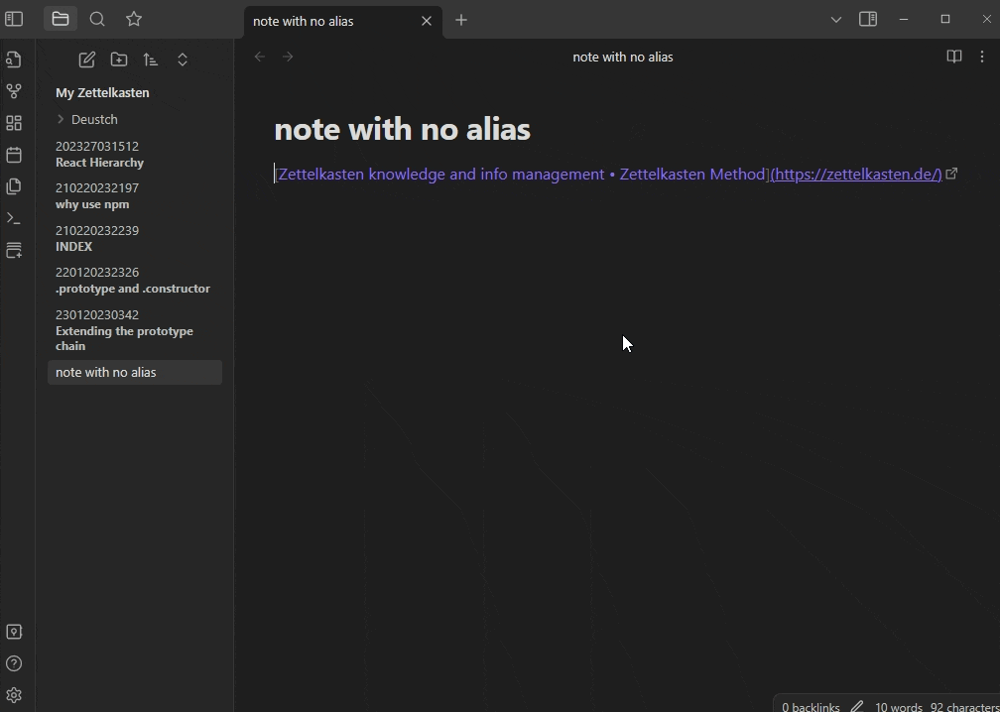

# Frontmatter Alias Display
A plugin for Obsidian.md to show front-matter aliases as display names in the File Explorer. Right now, it only supports the File Explorer but I'm planning to implement it in the Graph View as well.

## Why?
"Why don't you just use write the note?" 
Many people who are using Obsidian as a [Zettelkasten](https://zettelkasten.de/) will immediately realize that it is kind of difficult to navigate the File Explorer when all you see are notes with arbitrary titles (e.g. `202303041748` aka ID) instead of a more informative title such as `the difference between .prototype and .constructor`.

Those arbitrary titles, or more accurately, IDs, make for easy navigation and linking between notes, which is the core concept of the Zettelkasten method, while also ensuring that no two notes have the same ID.

#### Feedback
I would love to hear from you guys and get constructive criticism about ways to improve this plugin, especially feedback related to the implementation and usage of the API and TypeScript in general.

#### Warning
This is my first time developing a plugin and working with the Obsidian API. Test the plugin inside a dummy Vault beforehand. Use at your own discretion.

#### Todo
- [ ] Expand functionality into the Graph View
- [ ] Add a settings menu for customization and other options
